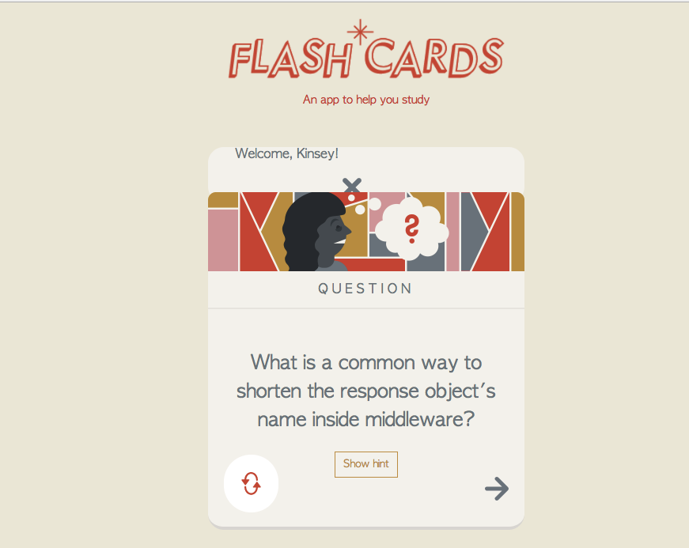
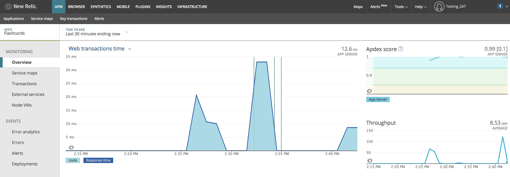
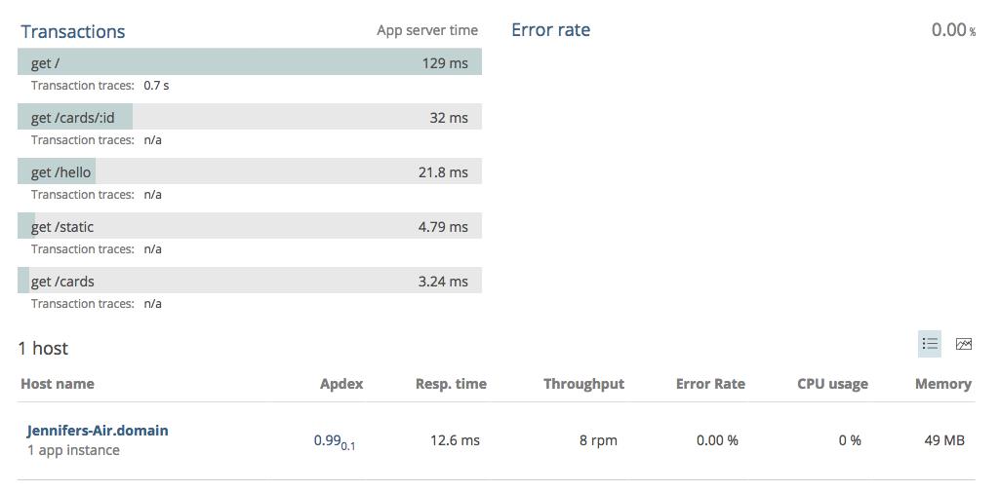
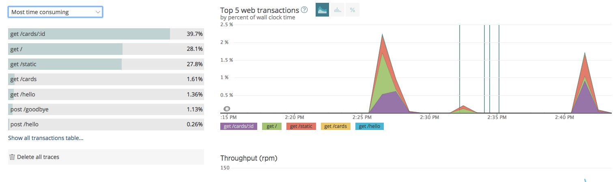

# Flashcards

## Description

This is a simple NodeJS app built on the Express Framework. This was built following along with the Team Treehouse tutorial for Express.
https://teamtreehouse.com/library/express-basics-2

It's a flashcard app featuring Pug templating, basic error handling, routing in express, HTTP GET and POST, form processing, and utilization of Middleware.

This site has been deployed to Heroku:
https://new-relic-node-test.herokuapp.com/

And I also experimented with the New Relic APM tool. (Screenshots below)

## Requirements:
* NodeJS
* NPM
* Express
* Nodemon (optional)

## Installation

* `git clone https://github.com/jennifer-kinsey/node_flashcards.git` this repository
* `cd node_flashcards`
* `npm install`
* `node app.js`
*  the app will be serving on http://localhost:3000/

## Screenshots

#### Flashcard App Screenshots

(The answer is "res"!)

#### New Relic APM (Application Programming MAGIC) Screenshots

